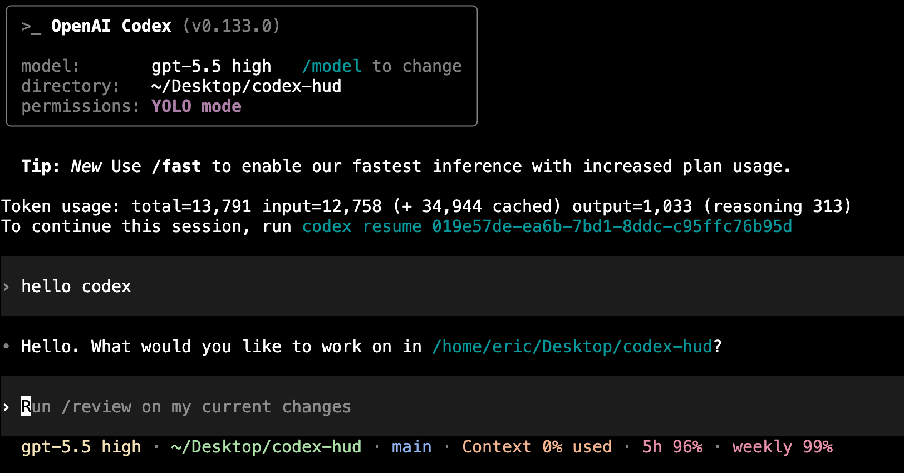

# Codex HUD

[English](README.md) | 中文

Codex HUD 是基于 [`jarrodwatts/claude-hud`](https://github.com/jarrodwatts/claude-hud) 改造的 Codex 插件。它保留了原项目的终端 HUD 渲染风格，并针对 Codex 做了适配：读取 Codex 的 rollout JSONL 会话文件，提供 Codex 插件命令和 skills，并且可以把 Codex 原生 TUI footer 配置成当前平台最接近 HUD 的固定字段。

## 演示



## 显示内容

- 模型名和 reasoning effort
- 项目路径和 git 分支/状态
- 上下文使用量和 token 明细
- Codex 记录到的 5 小时和周使用限制
- 工具调用、todos、agents、会话时长、会话 token 总量
- 英文和简体中文 HUD 标签

## 仓库结构

```text
.agents/plugins/marketplace.json   # 仓库本地 Codex marketplace
plugins/codex-hud/                 # Codex 插件源码
plugins/codex-hud/dist/            # 插件安装可直接运行的构建产物
plugins/codex-hud/commands/        # /setup 和 /configure 插件命令
plugins/codex-hud/skills/          # setup/configure 相关 Codex skills
plugins/codex-hud/scripts/         # 本地配置辅助脚本
```

## 从本仓库安装

```bash
git clone https://github.com/panzhufeng/codex-hud.git
cd codex-hud
codex plugin marketplace add "$PWD"
codex plugin add codex-hud@codex-hud
```

验证：

```bash
codex plugin list | rg 'codex-hud'
node plugins/codex-hud/dist/index.js
```

## 全局个人安装

如果想把插件作为本机全局个人插件安装，可以放到 `~/plugins/codex-hud`，并注册到默认 personal marketplace：`~/.agents/plugins/marketplace.json`。

```bash
mkdir -p ~/plugins ~/.agents/plugins
rsync -a --delete --exclude node_modules plugins/codex-hud/ ~/plugins/codex-hud/
```

如果你还没有 personal marketplace 文件，可以创建一个：

```bash
test -f ~/.agents/plugins/marketplace.json || cat > ~/.agents/plugins/marketplace.json <<'JSON'
{
  "name": "personal",
  "interface": {
    "displayName": "Personal"
  },
  "plugins": [
    {
      "name": "codex-hud",
      "source": {
        "source": "local",
        "path": "./plugins/codex-hud"
      },
      "policy": {
        "installation": "AVAILABLE",
        "authentication": "ON_INSTALL"
      },
      "category": "Productivity"
    }
  ]
}
JSON
```

如果已经有 personal marketplace，请在保留现有插件的前提下增加一个指向 `./plugins/codex-hud` 的 `codex-hud` 条目。然后安装：

```bash
codex plugin add codex-hud@personal
```

## 配置

Codex HUD 自己的显示配置文件位置：

```text
${CODEX_HUD_CONFIG_DIR:-${CODEX_HOME:-~/.codex}}/plugins/codex-hud/config.json
```

常用配置：

```bash
cd plugins/codex-hud
node scripts/configure.mjs --preset full --layout expanded --language en
node scripts/configure.mjs --preset essential --layout compact-separators
node scripts/configure.mjs --language zh-Hans
node scripts/configure.mjs --show tools,agents,todos,sessionTokens
node scripts/configure.mjs --hide usage,speed,counts
node scripts/configure.mjs --git-style files
```

把 Codex 原生固定 footer 配置成当前最接近 HUD 的字段：

```bash
node scripts/configure-codex-tui-statusline.mjs
```

这个脚本会写入 `~/.codex/config.toml` 的 `[tui].status_line`，使用 Codex 原生字段，例如 `model-with-reasoning`、`current-dir`、`git-branch`、`context-used`、`five-hour-limit`、`weekly-limit`。如果已有配置，脚本会先创建带时间戳的备份。

## 插件命令

安装后开启新的 Codex 对话，可以使用：

```text
/setup
/configure
```

插件也提供 setup 和 configure skills；当你让 Codex 安装、验证、运行或自定义 Codex HUD 时，它可以自动调用这些说明。

## 开发

```bash
cd plugins/codex-hud
npm install
npm run build
npm test
node dist/index.js
```

渲染指定会话：

```bash
CODEX_HUD_SESSION="$HOME/.codex/sessions/YYYY/MM/DD/rollout-....jsonl" \
  node dist/index.js
```

校验插件 manifest：

```bash
python3 /path/to/plugin-creator/scripts/validate_plugin.py plugins/codex-hud
```

## Codex 平台限制

`claude-hud` 依赖 Claude Code 的原生 `statusLine.command` API，可以把任意命令输出固定显示在输入区下方。当前 Codex CLI 支持 plugins、skills、commands、hooks、apps/MCP，以及固定字段的 `[tui].status_line`，但还没有等价的 command-backed statusline provider。因此 Codex HUD 已经提供了渲染器、session 解析、插件命令、skills、配置工具和当前最接近的原生 footer 配置，但还不能像 `claude-hud` 一样把完整 ANSI HUD 固定在完全相同的位置。

## 致谢

本项目改造自 [`jarrodwatts/claude-hud`](https://github.com/jarrodwatts/claude-hud)。Codex rollout 解析、Codex 插件封装、setup/configure 命令以及 Codex TUI footer 辅助脚本是本仓库针对 Codex 增加的部分。
